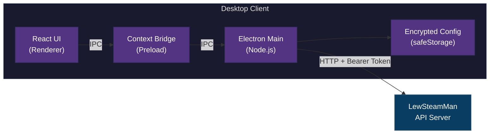

<div align="center">

# LewSteamMan Desktop

[](https://electronjs.org)
[](https://react.dev)
[](https://typescriptlang.org)
[](/)
[](/)

**Desktop client for [LewSteamMan](https://github.com/Lewonte/LewSteamMan) — manage your Steam authenticators from the taskbar.**

</div>

---

> **Work in progress:** LewSteamMan Desktop is an experimental companion app for a personal self-hosted server. It can display and copy sensitive account credentials, so use it only with a server you control.

> **License:** No open-source license has been selected yet. The repository is public for visibility and development, but reuse/redistribution rights are not granted until a license is added.

---

## Features

| | Feature | Description |
|:---:|:---|:---|
| :key: | **Live 2FA Codes** | Steam Guard codes with countdown timer, auto-refresh on expiry |
| :clipboard: | **One-Click Copy** | Copy codes, usernames, and passwords to clipboard instantly |
| :lock: | **Credentials View** | See full login credentials with password reveal toggle |
| :iphone: | **QR Login Approval** | Paste a challenge URL to approve Steam QR logins |
| :gear: | **First-Launch Setup** | Guided onboarding to connect to your API server |
| :computer: | **System Tray** | Minimizes to tray — always accessible from your taskbar |
| :shield: | **Secure by Design** | Bearer token stored via OS keychain, all API calls proxied through main process |

---

## Architecture



> The renderer **never** touches the API token or makes HTTP requests directly.
> All network calls are proxied through the main process via IPC.

---

## Quick Start

### Prerequisites

- [Node.js](https://nodejs.org) 18+
- A running [LewSteamMan API server](https://github.com/Lewonte/LewSteamMan)

### Install & Run

Windows PowerShell:

```powershell
git clone https://github.com/Lewonte/lewsteamman-desktop.git
cd lewsteamman-desktop
& 'C:\Program Files\nodejs\npm.cmd' install
& 'C:\Program Files\nodejs\npm.cmd' run dev
```

macOS/Linux:

```bash
git clone https://github.com/Lewonte/lewsteamman-desktop.git
cd lewsteamman-desktop
npm install
npm run dev
```

On first launch, you'll be prompted to enter your API URL and bearer token.

### Build Installer

Windows PowerShell:

```powershell
& 'C:\Program Files\nodejs\npm.cmd' run build:win
```

macOS/Linux:

```bash
# Windows
npm run build:win

# macOS
npm run build:mac

# Linux
npm run build:linux
```

Installers are output to the `dist/` directory.

### Checks

Windows PowerShell:

```powershell
& 'C:\Program Files\nodejs\npm.cmd' run typecheck
& 'C:\Program Files\nodejs\npm.cmd' run build
```

macOS/Linux:

```bash
npm run typecheck
npm run build
```

### Release Build

GitHub Actions builds the Windows installer when a version tag is pushed:

```bash
git tag v0.1.0
git push origin v0.1.0
```

The workflow also supports manual runs from the Actions tab. Tagged runs create a GitHub Release and attach the Windows `.exe`.

---

## Project Structure

```
src/
├── main/                        # Electron main process
│   ├── index.ts                 # Window creation, system tray
│   ├── ipc-handlers.ts          # IPC → API proxy with auth headers
│   └── store.ts                 # Encrypted config (electron-store + safeStorage)
├── preload/
│   ├── index.ts                 # contextBridge exposing window.api
│   └── index.d.ts               # TypeScript declarations
└── renderer/                    # React application
    ├── App.tsx                  # Root with settings/account routing
    ├── main.tsx                 # Entry point + providers
    ├── api/types.ts             # API type definitions
    ├── hooks/
    │   ├── useAccounts.ts       # Account list query
    │   ├── use2FACode.ts        # 2FA code with auto-refresh
    │   ├── useCredentials.ts    # On-demand credential fetch
    │   └── useApproveLogin.ts   # QR login mutation
    ├── components/
    │   ├── AccountList.tsx      # Account grid with loading/error states
    │   ├── AccountCard.tsx      # Account row with code + action buttons
    │   ├── CodeDisplay.tsx      # 2FA code with animated countdown ring
    │   ├── CredentialsModal.tsx  # Username/password/code with copy
    │   ├── QRApprovalDialog.tsx  # Challenge URL input + submit
    │   └── SettingsDialog.tsx   # API connection configuration
    └── styles/globals.css       # Tailwind + dark theme
```

---

## Tech Stack

| Layer | Technology |
|:---|:---|
| Desktop Shell | Electron 33 |
| Build Toolchain | electron-vite + Vite 5 |
| UI Framework | React 19 + TypeScript |
| State Management | TanStack Query 5 |
| Styling | Tailwind CSS 4 |
| Icons | Lucide React |
| Notifications | Sonner |
| Config Storage | electron-store + safeStorage |
| Packaging | electron-builder |

---

## Security

- **Token storage**: The API bearer token is encrypted using Electron's `safeStorage` API, which delegates to the OS keychain (Windows Credential Manager, macOS Keychain, Linux Secret Service)
- **Context isolation**: `contextIsolation: true`, `nodeIntegration: false` — the renderer has no direct access to Node.js or Electron APIs
- **IPC proxy**: All HTTP requests to the API server are made from the main process; the renderer never sees the bearer token or constructs network requests

See [SECURITY.md](SECURITY.md) before reporting security-sensitive issues.

---

## Screenshots

Public-safe screenshot guidance lives in [docs/screenshots.md](docs/screenshots.md).
Only commit screenshots or GIFs that use fake accounts, fake IDs, and no live
tokens, passwords, or 2FA codes.

---

## Contributing

See [CONTRIBUTING.md](CONTRIBUTING.md) for setup, checks, and contribution
guidelines.

---

<div align="center">
<sub>Desktop client for <a href="https://github.com/Lewonte/LewSteamMan">LewSteamMan</a>.</sub>
</div>
